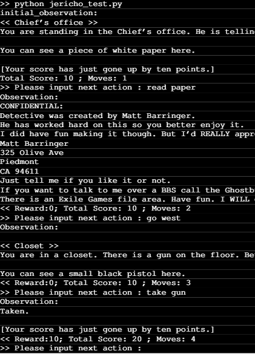
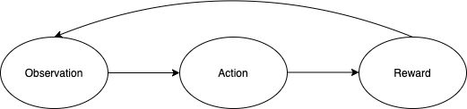

# Game History

The origin of interactive fiction can be traced to the 1960s and 1970s, when the simple natural language processing could be applied onto software programs. In the 1970s, Will Crowther, a programmer and an amateur caver, wrote the first text adventure game, [ADVENT](http://hdl.handle.net/2142/16406), which was further spread to the Internet and inspired many people to design and write their own text adventure games, like the [Dog Star Adventure](https://www.mobygames.com/game/dog-star-adventure), the [ZORK](https://adventuregamers.com/gameseries/view/1582)  series, etc. 

In the 1980s, IF became a standard product for many software companies, and the interactive fiction occurred outside the U.S. But since the 1990s, the market of IF has been declining due to the growth of multi-media games.

# Game Environments and platforms

From an interactive fiction to an interactive game, we need a platform to support the game environment and control the workflow. There are plenty of open source platforms able to create traditional parser-driven IF in which the user types text-based commands — for example, go east, go downstairs, read the newspaper — to interact with the game. From the 1990s to present, we have many successful IF platforms. And in the past decade, the two most popular platforms might be the [Jericho](https://github.com/microsoft/jericho) and [TextWorld](https://www.microsoft.com/en-us/research/project/textworld/) from Microsoft. And Facebook, Inc. also launched [LIGHT](https://ai.facebook.com/blog/introducing-light-a-multiplayer-text-adventure-game-for-dialogue-research/) as its text interactive platform for dialogue research.

In this project, we select Jericho as our platform for the text-adventure games. It is a lightweight python-based interface connecting learning agents with interactive fiction games. It runs on Linux-like systems and is easy to install or serve.

# Game Scenario

We choose a single player text-adventure game whose name is “Detective” as an example to show you he basic scenario of a text-adventure game: the player character is a famous detective. At the beginning of the game, the player is standing in the police chief's office and is asked to investigate the mayor’s murder case. The player should search the neighbor area for clues and evidence. Some events and clues are embedded in room descriptions. The Figure below is a example of how we play the Detective game.

The entire game is based on text and we only need a terminal with python environment to run it. Look at the Figure below, the game process is formed by three elements: observation, action and reward. Each turn, the player gets the observation, and then takes action according to this information. Then the game engine will tell the player how many scores he gets by taking this action. The Figure above is an example of our game. Through the observation, the player finds a gun on the floor. And he just typed “take gun” in the terminal as an action. Then he got 10 scores as a reward because this is a clue for the murder case. For some useless action, you can also see that the player gets zero reward. 

The ultimate goal of the player is to get as much reward as possible in a limited number of actions.