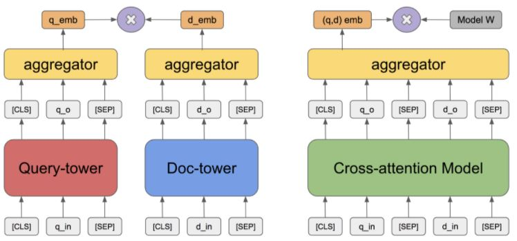

# Overview of the Learning Framework
The game starts with description of the game background $s_0$. At each time step $t$, the agent issues a textual action $a_t \in A_t$ based on the environment description $s_t$. Then the agent receives a reward $r_t$ according to the game score earned by $a_t$. The environment description is updated to $s_{t+1}$. The game stops when the agent reach some special states or the maximum steps.

We define the Q-function as the expected reward of taking the action $a_t$ under the state $s_t$ 
$$Q(s_t, a_t) = E[r + \gamma \max_{a_{t+1}} Q(s_{t+1}, a_{t+1}) | s_t, a_t],$$
where $\gamma$ is a discount factor. 
For inference, we choose the action with the maximum Q-value
$$\pi(s_t) = \arg\max_{a_t \in A_t} Q(s_t, a_t).$$
In our framework, the Q-function is fitted by deep text matching networks taking textual descriptions of states and actions as input features.

# Two-tower State-action Matching
Two-tower matching models have been used in various of text matching tasks. The query and candidate embeddings are from two independent text encoders and then aggregated to calculate the matching score. 

We apply BERT as text encoders for both actions and states. The textual descriptions of candidate actions and states are encoded by different BERT models. The encoded representations are concatenated and then fed to a multi-layer perceptron (MLP).

# Cross-attention State-action Matching
Cross-attention matching models is another type of matching models. Previous work have shown that cross-attention models usually produce better results but cost longer computation time in comparison with two-tower models. 

We apply BERT as the joint encoder of actions and states. Following, we combine the text sequence of action and state and distinguish them by adding different segment tokens. The final representation of the first token [CLS] is then sent to a MLP to calculate the score.

# Pre-trained Language Model

Recently, language models pre-trained on a large scale of corpus demonstrate surprising power in encoding context and semantic information and bring natural language processing to a new era, among which BERT obtained the state-of-the-art results on eleven popular natural language processing tasks when it was proposed in 2018. Nowadays, the BERT has become the backbone and foundation of many other works related to natural language processing.

In detail, BERT is a transformer-based architecture pre trained with two tasks: Masked Language Model(MLM) and Next Sentence Prediction(NSP). In MLM, the model needs to predict the masked tokens in the original sentence, and in this way, it learns to capture the bidirectional contextual information. In NSP, the model needs to predict whether the given two sentences are consecutive, aiming to capture the relationship between different sentences. After the pre-training, BERT can be fine-tuned in many downstream tasks, i.e., Question Answering.

In our work, we use BERT to encode the textual description and explore the relationship between states and actions.

# History Actions
Why we use historical Actions?

# Result

| Game   |      best steps      |  RAND | NAIL | TDQN | DRRN | DRRN_BERT_MEMO | MaxScore
|----------|:-------------:|:------:|:------:|:------:|:------:|:------:|:------:|
| Detective |  50 |  113.7 | 136.9 | 169 | 197.8 | 290 | 360 |
| Deephome |    350 | 1 | 13.3 | 1 | 1 | 25 | 300 |

